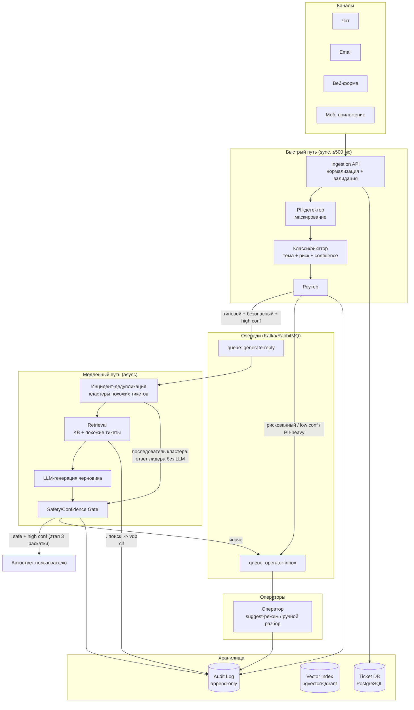
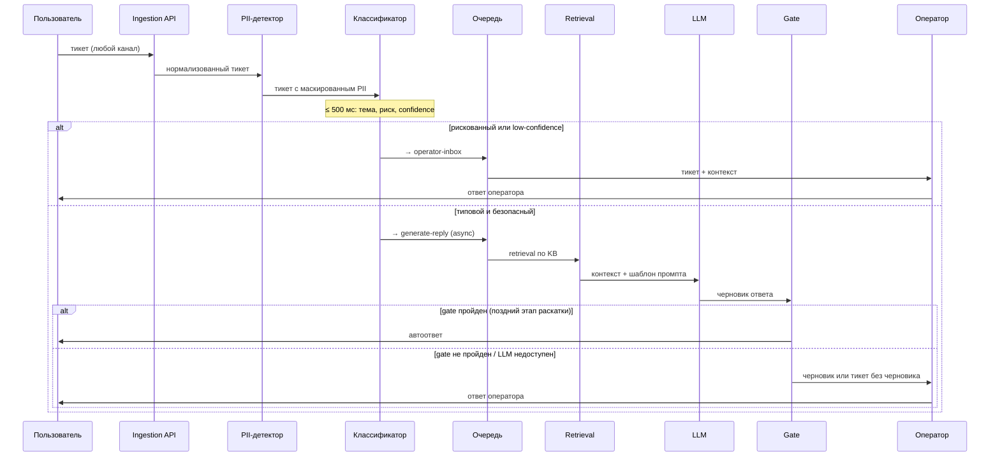
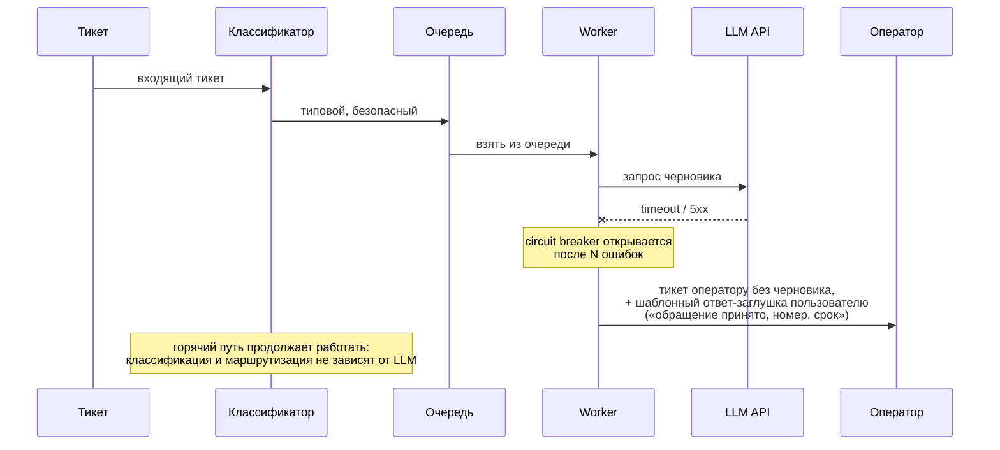

# Целевая архитектура

Система автоматизации обработки тикетов поддержки: ~200k тикетов/день (~2,3 rps в норме), пики до 10–20k за 10 минут (~33 rps), требование ≤ 500 мс на классификацию/маршрутизацию, асинхронная генерация ответов, human-in-the-loop для рискованных категорий.

## Ключевые принципы

1. **Разделение быстрого и медленного пути.**
Будем использовать простые и быстрые модели на начальных этапах, при появлении сложностей - переход к более сложному и глубокому анализу.
Классификация и маршрутизация синхронные лёгкие сервисы без LLM. Генерация ответа — асинхронная, через очередь.
2. **LLM не обязательна.** Недоступность LLM API не блокирует приём и маршрутизацию тикетов.
3. **Обфускация личных данных на начальных этапах.** Все чувствительные данные не проникают дальше по пути
4. **Human-in-the-loop по умолчанию.** Автообработка — только для явно безопасных категорий с высокой уверенностью. Всё остальное — черновик оператору или прямая эскалация.
5. **Аудит всех автоматических решений.** Каждое решение системы записывается в лог для дальнешей аналитики.

## Схема компонентов

## Поток данных: от тикета до ответа

## Синхронные и асинхронные части

| Часть | Режим | Бюджет | Почему |
|---|---|---|---|
| Ingestion, нормализация | sync | ~50 мс | Приём нельзя терять |
| PII-маскирование | sync | ~50 мс | До любых внешних вызовов |
| Классификация темы/риска | sync | ~200 мс | Лёгкая модель, на горячем пути |
| Маршрутизация | sync | ~10 мс | Правила поверх классификации |
| Retrieval | async | секунды | Не блокирует приём |
| LLM-генерация | async | секунды–десятки секунд | Дорого, медленно, может падать |
| Запись в audit log | async | — | Не блокирует путь |

## Хранилища

- **Ticket DB (PostgreSQL)** — тикеты, статусы, результаты классификации, назначения.
- **Vector Index (pgvector на старте, Qdrant при росте)** — embeddings статей KB и исторических тикетов.
- **Audit Log (append-only: отдельная таблица / S3 + партиции)** — каждое автоматическое решение: вход (маскированный), версия модели, confidence, действие, результат gate.
- **Object storage** — вложения тикетов.
- **Кэш (Redis)** — ответы на дедуплицированные инцидентные тикеты, rate-limit счётчики, ₽-бюджет LLM.

## Интеграции и места вызова внешних сервисов

- **LLM API** — только из async-воркера генерации; вход всегда с маскированным PII; на каждый вызов — таймаут, retry с backoff, circuit breaker, лимит бюджета (токены/₽ в час).
- **База знаний (KB)** — индексируется в vector index в фоне по cron-у.
- **Helpdesk-система операторов** — очередь подсказок для оператора интегрируется с системой управления ответами.

## Участие человека (human-in-the-loop)

| Ситуация | Действие |
|---|---|
| Рискованные категории (платежи/споры, аккаунт/безопасность, юридические, жалобы на вред) | Всегда оператор; LLM максимум готовит черновик |
| Confidence классификатора ниже порога | Оператор, без автоответа |
| Gate после генерации не пройден (safety/уверенность) | Черновик оператору |
| Обычный типовой тикет на этапах shadow/suggest | Черновик оператору (suggest) |
| Типовой безопасный тикет, high confidence, этап 3 раскатки | Автоответ + выборочный пост-аудит оператором |

## Запасные пути (fallback)

1. **LLM API недоступен** система деградирует до retrieval-only (ссылки на статьи KB / шаблонные ответы) или прямой маршрутизации к оператору. Приём и классификация не страдают.
2. **Пик нагрузки (инцидент)** → очередь сглаживает всплеск; включается **инцидентный режим**: дедупликация тикетов по типу, один ответ на тип вместо 10–20k индивидуальных генераций; LLM-генерация для дублей отключается. В PoC реализовано в [loadguard.py](../src/app/services/loadguard.py) и показано в `python -m app.demo_spike`.
3. **Превышен бюджет LLM** аналогично недоступности LLM.
4. **Классификатор деградировал / недоступен** fallback на rule-based классификатор (ключевые слова); при полном отказе все тикеты идут в operator-inbox — система переходит в режим обычной поддержки.
5. **Vector index недоступен** → генерация без retrieval отключается (появляется риск галлюцинаций), тикеты идут оператору с пометкой.

Как выглядит деградация при отказе LLM (в PoC: `python -m app.demo --llm-down`):

Руководствуемся принципом, система при отказе должна работать как старая система без автоматизации.

## Что в PoC, а что — дизайн

| Компонент | В PoC (реализовано) | В целевой архитектуре |
|---|---|---|
| Ingestion | FastAPI `POST /tickets` | HTTP API + очередь |
| PII-маскирование | Presidio: pattern-рекогнайзеры (email/телефон/карта с Luhn), без NER | Presidio + NER-модель |
| Классификатор | правила по ключевым словам + калиброванный confidence | лёгкая ML-модель (см. [ml.md](ml.md)) |
| Retrieval | TF-IDF по локальной мини-KB | embeddings + pgvector/Qdrant |
| LLM | LangChain + OpenRouter (keyless — детерминированный fake) + промпт-изоляция + выходной gate (PII/groundedness) | LLM API за circuit breaker; adversarial-тесты, LLM-judge groundedness |
| Дедупликация инцидентов | Jaccard по токенам + blocking по теме ([loadguard.py](../src/app/services/loadguard.py)) | embeddings + LSH + streaming-кластеризация |
| Бюджет LLM | in-memory счётчик + дневной лимит вызовов | распределённый счётчик в Redis + алерты |
| Очереди | вызовы функций по порядку | Kafka/RabbitMQ |
| Audit log | append-only таблица decisions (SQLite) | append-only таблица/S3 |
| Оператор | действия `suggest_to_operator` / `escalate_to_operator` в decision log | интеграция с helpdesk |
