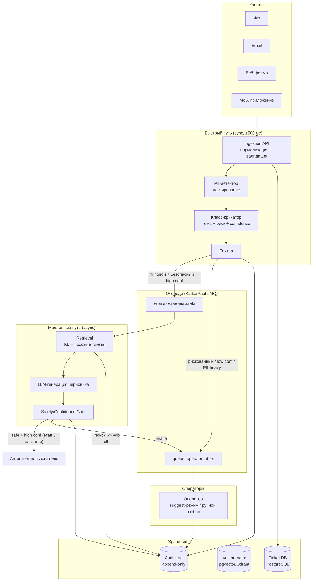
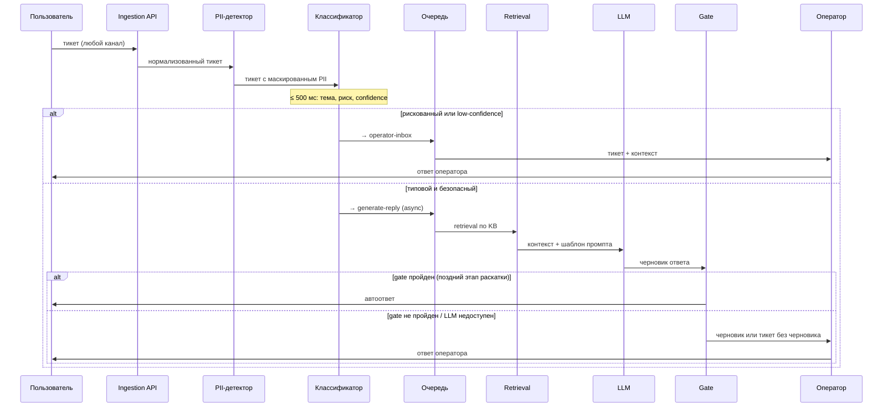

# Целевая архитектура

Система автоматизации обработки тикетов поддержки: ~200k тикетов/день, пики до 10–20k за 10 минут, требование ≤ 500 мс на классификацию/маршрутизацию, асинхронная генерация ответов, human-in-the-loop для рискованных категорий.

## Ключевые принципы

1. **Разделение быстрого и медленного пути.** Классификация и маршрутизация — синхронные, лёгкие, без LLM. Генерация ответа — асинхронная, через очередь.
2. **LLM не на критическом пути.** Недоступность LLM API не блокирует приём и маршрутизацию тикетов.
3. **Human-in-the-loop по умолчанию.** Автозакрытие — только для явно безопасных категорий с высокой уверенностью; всё остальное — черновик оператору или прямая эскалация.
4. **Аудит всех автоматических решений.** Каждое решение системы записывается в append-only лог.

## Схема компонентов

## Поток данных: от тикета до ответа

## Синхронные и асинхронные части

| Часть | Режим | Бюджет | Почему |
|---|---|---|---|
| Ingestion, нормализация | sync | ~50 мс | Приём нельзя терять |
| PII-маскирование | sync | ~50 мс | До любых внешних вызовов |
| Классификация темы/риска | sync | ~200 мс | Лёгкая модель, на горячем пути |
| Маршрутизация | sync | ~10 мс | Правила поверх классификации |
| Retrieval | async | секунды | Не блокирует приём |
| LLM-генерация | async | секунды–десятки секунд | Дорого, медленно, может падать |
| Запись в audit log | async (fire-and-forget с ретраями) | — | Не блокирует путь |

## Хранилища

- **Ticket DB (PostgreSQL)** — тикеты, статусы, результаты классификации, назначения.
- **Vector Index (pgvector на старте, Qdrant при росте)** — embeddings статей KB и исторических тикетов.
- **Audit Log (append-only: отдельная таблица / S3 + партиции)** — каждое автоматическое решение: вход (маскированный), версия модели, confidence, действие, результат gate.
- **Object storage** — вложения тикетов.
- **Кэш (Redis)** — ответы на дедуплицированные инцидентные тикеты, rate-limit счётчики, бюджет LLM.

## Интеграции и места вызова внешних сервисов

- **LLM API** — только из async-воркера генерации; вход всегда с маскированным PII; на каждый вызов — таймаут, retry с backoff, circuit breaker, лимит бюджета (токены/₽ в час).
- **База знаний (KB)** — индексируется в vector index периодическим ETL.
- **Helpdesk-система операторов** — очередь operator-inbox интегрируется с существующим инструментом оператора (черновик показывается как suggestion).

## Участие человека (human-in-the-loop)

| Ситуация | Действие |
|---|---|
| Категория из risk-списка (платежи/споры, аккаунт/безопасность, юридические, жалобы на вред) | Всегда оператор; LLM максимум готовит черновик |
| Confidence классификатора ниже порога | Оператор, без автоответа |
| Gate после генерации не пройден (safety/уверенность) | Черновик оператору |
| Обычный типовой тикет на этапах shadow/suggest | Черновик оператору (suggest) |
| Типовой безопасный тикет, high confidence, этап 3 раскатки | Автоответ + выборочный пост-аудит оператором |

## Запасные пути (fallback)

1. **LLM API недоступен** → circuit breaker открывается; система деградирует до retrieval-only (ссылки на статьи KB / шаблонные ответы) или прямой маршрутизации к оператору. Приём и классификация не страдают.
2. **Пик нагрузки (инцидент)** → очередь сглаживает всплеск; включается **инцидентный режим**: дедупликация тикетов по кластеру (embedding similarity), один массовый статус-ответ на кластер вместо 10–20k индивидуальных генераций; LLM-генерация для дублей отключается.
3. **Превышен бюджет LLM** → воркер генерации переключается на шаблоны/retrieval-only до сброса лимита; алерт команде.
4. **Классификатор деградировал / недоступен** → fallback на rule-based классификатор (ключевые слова); при полном отказе все тикеты идут в operator-inbox — система «честно» превращается в обычную поддержку, ничего не теряя.
5. **Vector index недоступен** → генерация без retrieval отключается (риск галлюцинаций), тикеты идут оператору с пометкой.

## Что в PoC, а что — дизайн

| Компонент | В PoC | В целевой архитектуре |
|---|---|---|
| Ingestion | чтение JSON-файлов | HTTP API + очередь |
| PII-маскирование | regex-правила | regex + NER-модель |
| Классификатор | правила по ключевым словам + confidence | лёгкая ML-модель (см. ml.md) |
| Retrieval | TF-IDF по локальной мини-KB | embeddings + pgvector/Qdrant |
| LLM | шаблонный mock-генератор + промпт-изоляция + выходной gate (PII/groundedness) | LLM API за circuit breaker; adversarial-тесты, LLM-judge groundedness |
| Очереди | вызовы функций по порядку | Kafka/RabbitMQ |
| Audit log | JSONL-файл | append-only таблица/S3 |
| Оператор | запись в operator-inbox JSONL | интеграция с helpdesk |