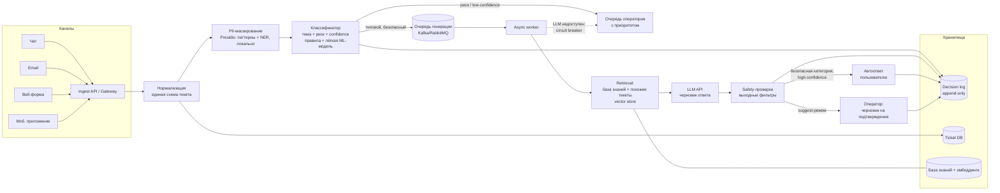
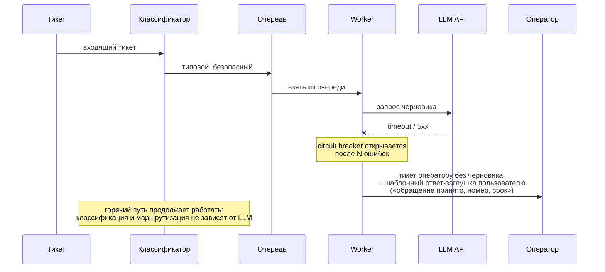

# Архитектура системы автоматизации тикетов поддержки

## Ключевая идея

Поток обработки разделён на **два пути** с разными требованиями:

| Путь | Что делает | Латентность | Отказ допустим? |
|---|---|---|---|
| **Горячий (синхронный)** | нормализация, PII-маскирование, классификация темы/риска, маршрутизация | ≤ 500 мс на тикет | нет — деградирует до правил |
| **Холодный (асинхронный)** | retrieval по базе знаний, генерация черновика ответа LLM, safety-проверки | секунды–минуты, через очередь | да — тикет просто уходит оператору без черновика |

Это прямое следствие требований кейса: классификация и маршрутизация обязаны укладываться в 500 мс и работать даже при недоступности LLM, а генерация ответа может быть асинхронной.

## Общая схема

## Компоненты и решения

### 1. Ingest / Gateway
Принимает тикеты из всех каналов, приводит к единой схеме (`ticket_id, channel, user_id, text, created_at, metadata`). Stateless, горизонтально масштабируется. При всплеске 10–20k тикетов за 10 минут (~33 rps в пике против ~2,3 rps в норме) сам по себе не является узким местом — узкое место дальше, поэтому сразу за ingest стоит буфер.

### 2. PII-маскирование — до любых внешних вызовов
Regex-правила (телефоны, email, карты) + лёгкий локальный NER. Выполняется **внутри контура компании**; во внешний LLM API уходит только маскированный текст. Это осознанная граница доверия: всё, что левее очереди генерации, не покидает контур.

### 3. Классификатор темы и риска (горячий путь)
Каскад: сначала детерминированные правила (ключевые слова рискованных категорий: оплата, ПДн, юр. претензии, безопасность аккаунта), затем лёгкая классическая модель (см. [ml.md](ml.md)). LLM на горячем пути **не используется** — не укладывается в 500 мс и стоит дорого на 200k тикетов/день. Выход: `topic, risk_level, confidence`.

Маршрутизация по политике:
- `risk = high` **или** `confidence < порога` → очередь операторов (эскалация), без генерации;
- иначе → очередь генерации черновика.

### 4. Очередь генерации (асинхронная граница)
Kafka/RabbitMQ. Роли: сглаживание пиков (backpressure вместо отказов), развязка горячего и холодного пути, retry-политика. При инцидентных всплесках здесь же работает **дедупликация**: похожие тикеты (по эмбеддингу/шинглам) склеиваются в инцидент-кластер — один черновик на кластер вместо 10k вызовов LLM.

### 5. Retrieval + LLM-worker (холодный путь)
Worker берёт тикет из очереди, ищет релевантные статьи базы знаний и похожие решённые тикеты (vector store: pgvector/Qdrant), собирает контекст и вызывает LLM для черновика ответа. Текст тикета передаётся как **данные, не как инструкции** (защита от prompt injection), выход проходит фильтры (нет PII, нет обещаний вне политики, ссылки только на KB).

### 6. Участие человека (human-in-the-loop)
Три режима выката, переключаются per-категория:
1. **shadow** — система решает «в тень», пользователю ничего не уходит; сравниваем с действиями операторов;
2. **suggest** — оператор видит черновик и confidence, подтверждает/правит;
3. **auto** — автоответ без оператора; включается только для категорий, доказавших качество в suggest-режиме, и **никогда** для рискованных категорий.

### 7. Decision log (аудит)
Каждое автоматическое решение — классификация, маршрут, черновик, автоответ — пишется append-only: вход (маскированный), версия модели/промпта, confidence, решение, кто подтвердил. Это одновременно аудит, источник разметки для дообучения и данные для мониторинга.

## Запасные пути (деградация)

- **LLM недоступен** → circuit breaker; генерация отключается, маршрутизация продолжает работать; пользователю уходит шаблонное подтверждение, тикет — оператору. Система теряет автоматизацию, но не SLA-критичную функцию.
- **Классификатор недоступен/деградировал** → fallback на чистые правила; правила не покрыли → маршрут «в общую очередь операторов» (как до внедрения системы).
- **Всплеск нагрузки** → очередь растёт, воркеры масштабируются по глубине очереди; дедупликация инцидентов срезает объём генерации; при превышении бюджета LLM генерация отключается для низкоприоритетных категорий раньше, чем для остальных.

Принцип: **безопасное состояние системы = «как было без автоматизации»**, а не «отказ в обслуживании».

## Синхронное vs асинхронное — сводка

| Операция | Режим | Обоснование |
|---|---|---|
| Ingest, нормализация, PII-mask | sync | дёшево, обязательно для всего далее |
| Классификация темы/риска | sync, ≤500 мс | лежит на пути маршрутизации |
| Retrieval + генерация черновика | async (очередь) | секунды латентности допустимы, LLM ненадёжен и дорог |
| Автоответ / выдача черновика оператору | async | зависит от генерации |
| Decision log | async (fire-and-forget с гарантией доставки) | не должен тормозить горячий путь |
